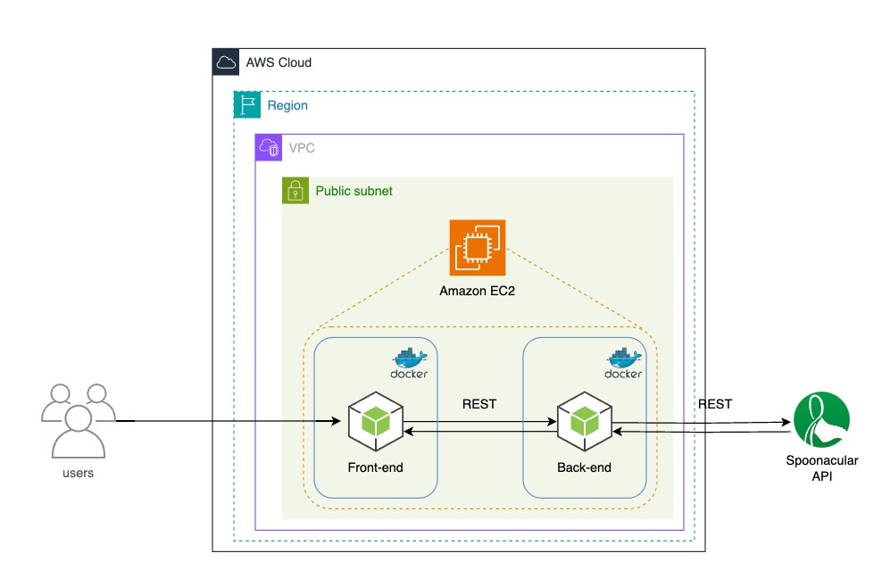

# MEAL PLANNER

### **OVERVIEW**

This project aims to develop the *Meal Planner*, an application designed to simplify and personalize meal planning, providing a customized meal plan based on dietary preferences and nutritional goals, enabling an easier path to eating tailored to your objectives. The application has been designed for cloud deployment, utilizing *Docker* for containerization, *AWS EC2* to provide scalable and on-demand computational power, and *Amazon ECR* for storing and managing *Docker* images. This ensures optimized, scalable, and reliable performance in the cloud.

### **MAIN FEATURES**

 - **Customization**: The application allows for the adjustment of meal plans, which can be weekly or daily, adopting any specific diet such as Omnivore, Pescetarian, Vegetarian, Ovo-Vegetarian, Lacto-Vegetarian, or Vegan, in addition to the possibility of limiting the number of daily calories.

 - **Convenience**: Specific information can be checked, such as the price of ingredients in the recipe or how sweet, salty, and spicy it is, for example.

 - **Practicality**: Details about the recipe are easily accessible, such as required ingredients, preparation time, number of servings, and a brief summary of the recipe.

 - **Cloud Integration**: The combination used offers an efficient application through on-demand computing from AWS EC2, a secure repository for Docker image manipulation with AWS ECR, and encapsulation in containers provided by Docker, ensuring more agility and ease in the execution and testing of the system.

### **ARCHITECTURE**

### **BACKEND ENDPOINTS**
  
  | **HTTP VERB** | **ENDPOINT**                         | **ACTION**                        |
  | ------------- | ------------------------------------ | ----------------------------------|
  | GET           | `/meal-plan/`                        | Generate meal plan                |
  | GET           | `/price-breakdown/{recipe_id}`       | Get price of ingredients          |
  | GET           | `/recipe-details/{recipe_id}`        | Get recipe details                |
  | GET           | `/taste/{recipe_id}`                 | Get flavor information            |

### **TECHNOLOGIES USED**

    | Node - Runtime environment for JS applications on a server   | Axios - A versatile library for HTTP requests
    | Dotenv - Essential module for loading environment variables  | Nodemon - Automatic restart of Node application
    | AWS EC2 - Cloud computing service for hosting applications   | AWS ECR - Storing and managing Docker container images
    | Handlebars - Template engine for rendering views on server   | Bootstrap - CSS framework for styling web pages
    | Docker - Developing, shipping, and running in containers     | Spoonacular - Recipes and nutrition external API

### **INSTALLATION GUIDE**

Clone this repository `https://github.com/GiovaneIwamoto/meal-planner`

Create the .env file using the provided example

Execute the command `docker compose -f docker-production.yml up`

Access the application through a web browser

### **AUTHORS**

[Giovane Iwamoto](https://github.com/GiovaneIwamoto) | [Felipe Pelissari](https://github.com/FeliPellissari) | [Isabela Buzzo Galvão](https://github.com/isabelabuzzo) | [Leandro Pereira](https://github.com/leojgpereira)

Giovane Hashinokuti Iwamoto - Computer Science student at UFMS - Brazil - MS

I am always open to receiving constructive criticism and suggestions for improvement in my developed code. I believe that feedback is an essential part of the learning and growth process, and I am eager to learn from others and make my code the best it can be. Whether it's a minor tweak or a major overhaul, I am willing to consider all suggestions and implement the changes that will benefit my code and its users.
